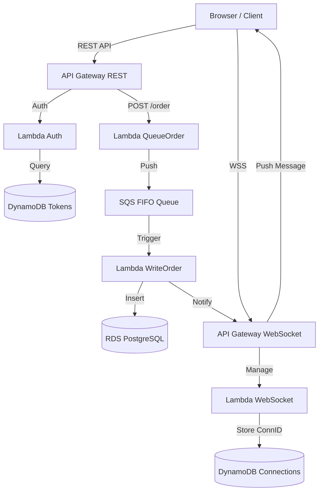

# 🎵 Sound Wave Production — Serverless Platform


Sound Wave Production adalah platform pemesanan tiket konser berbasis **Full Serverless Architecture** di AWS. Sistem ini dirancang untuk menangani trafik tinggi menggunakan pola asinkronus dengan SQS FIFO dan **Real-Time Notifications** melalui WebSocket API.

---

## 🏛️ Arsitektur Sistem (Real-Time Flow)



### Komponen Utama:
- **API Gateway WebSocket**: Menangani koneksi "Always-On" untuk notifikasi instan.
- **Amazon SQS FIFO**: Mengantri pesanan secara berurutan (*First-Come, First-Served*).
- **Real-Time Feedback**: SQS Worker mentrigger notifikasi WebSocket ke browser user begitu database sukses terupdate.
- **RDS PostgreSQL**: Database relasional dengan skema teroptimasi (`CASCADE Delete`).

---

## ⚙️ Setup Database & Infrastruktur

### 1. Database Schema (PostgreSQL)
Penting: Gunakan `ON DELETE CASCADE` agar saat Event dihapus, data Order & Tiket terkait otomatis bersih.

```sql
CREATE TABLE events (
    id VARCHAR(50) PRIMARY KEY,
    name VARCHAR(100) NOT NULL,
    date TIMESTAMP NOT NULL,
    venue VARCHAR(100),
    ticket_price NUMERIC(12,2),
    total_quota INTEGER,
    available_quota INTEGER
);

CREATE TABLE orders (
    id VARCHAR(50) PRIMARY KEY,
    event_id VARCHAR(50) REFERENCES events(id) ON DELETE CASCADE,
    name VARCHAR(100),
    email VARCHAR(100),
    phone VARCHAR(20),
    qty INTEGER,
    category VARCHAR(20),
    total NUMERIC(12,2),
    status VARCHAR(20) DEFAULT 'SUCCESS',
    created_at TIMESTAMP DEFAULT CURRENT_TIMESTAMP
);

CREATE TABLE tickets (
    id VARCHAR(50) PRIMARY KEY,
    order_id VARCHAR(50) REFERENCES orders(id) ON DELETE CASCADE,
    user_email VARCHAR(100),
    created_at TIMESTAMP DEFAULT CURRENT_TIMESTAMP
);
```

### 2. DynamoDB Tables
- **Table `tokens`**: Partition Key `token` (String).
- **Table `connections`**: Partition Key `connectionId` (String).

### 3. Environment Variables (Lambda)
| Fungsi | Variabel | Deskripsi |
| --- | --- | --- |
| **Global** | `DB_HOST`, `DB_NAME`, `DB_USER`, `DB_PASS` | Koneksi RDS |
| **queueOrder** | `SQS_QUEUE_URL` | URL Antrean SQS FIFO |
| **writeOrder** | `WS_ENDPOINT` | URL HTTPS API WebSocket (Tanpa /@connections) |

---

## 🚀 Deployment Frontend
Ganti endpoint di [frontend/app.js](frontend/app.js) baris 3-4:
```javascript
const API_BASE_URL = 'https://<api-id>.execute-api.us-west-2.amazonaws.com/prod';
const WS_URL = 'wss://<api-id>.execute-api.us-west-2.amazonaws.com/prod';
```

---

## 🛡️ Fitur Unggulan
- **Real-Time Notification**: Muncul popup "Order Berhasil" tanpa refresh halaman.
- **Deduplication Order**: Mencegah double-order meski user klik berkali-kali (Handled by SQS FIFO).
- **Atomic Quota**: (Optional Roadmap) Pengurangan kuota menggunakan transaksi database.

> *"Excellent UX begins with Real-Time Feedback."* — Sound Wave Team 🎸🏆
