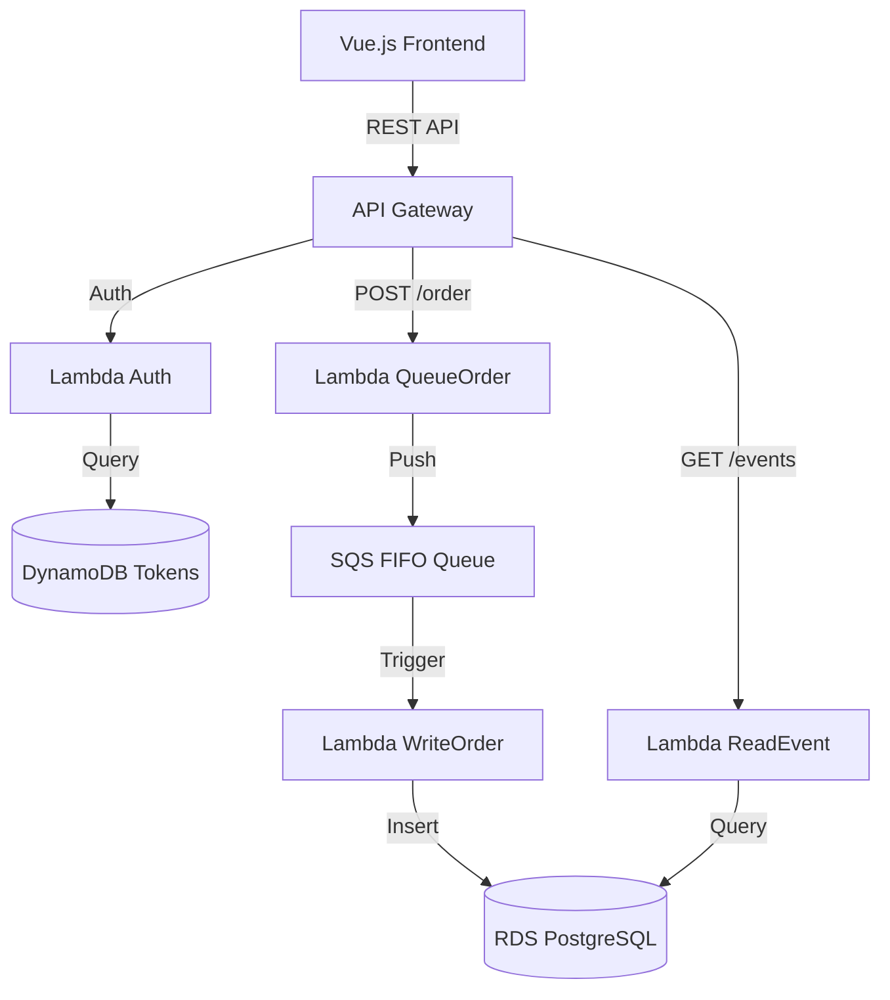

# 🎵 Sound Wave Production — Serverless Platform


Sound Wave Production adalah platform pemesanan tiket konser berbasis **Serverless Architecture** di AWS. Sistem ini dirancang untuk menangani trafik tinggi (*war ticket*) menggunakan pola asinkronus dengan SQS FIFO dan database relasional RDS PostgreSQL.

---

## 🏛️ Arsitektur Sistem



### Komponen Utama:
- **Frontend**: Single Page Application (SPA) dengan UI premium, dark mode, dan animasi terintegrasi.
- **API Gateway**: Entry point utama dengan **Custom Lambda Authorizer**.
- **AWS Lambda**: Logika bisnis (Read/Write Event, Queueing, Auth, Token).
- **Amazon SQS FIFO**: Menjamin urutan pemesanan tiket (*First-Come, First-Served*) dan mencegah duplikasi data.
- **RDS PostgreSQL**: Database utama untuk menyimpan data Event, Order, dan Tiket.
- **DynamoDB**: Penyimpanan token sesi yang cepat dan efisien.

---

## 📂 Struktur Folder

```text
├── frontend/             # Root aplikasi UI
│   ├── index.html        # Kerangka web
│   ├── style.css         # Modern Aesthetic CSS
│   └── app.js            # API Integration & State Management
│
├── backend/              # Node.js Lambda Functions
│   ├── auth.js           # Lambda Authorizer (Header validation)
│   ├── token.js          # Login & Token Generator (DyanmoDB)
│   ├── readEvent.js      # Fetch events dari RDS
│   ├── writeEvent.js     # Admin: Create event ke RDS
│   ├── queueOrder.js     # Producer: Kirim order ke SQS
│   ├── writeOrder.js     # Consumer: SQS trigger -> DB Transaction
│   └── ticket.js         # Fetch user tickets (Join Query)
```

---

## ⚙️ Setup & Konfigurasi

### 1. Database Schema (PostgreSQL)
Jalankan perintah ini di database RDS Anda:

```sql
CREATE TABLE events (
    id VARCHAR(50) PRIMARY KEY,
    name VARCHAR(100) NOT NULL,
    date TIMESTAMP NOT NULL,
    venue VARCHAR(100),
    ticket_price NUMERIC(12,2),
    total_quota INTEGER,
    available_quota INTEGER
);

CREATE TABLE orders (
    id VARCHAR(50) PRIMARY KEY,
    event_id VARCHAR(50) REFERENCES events(id),
    name VARCHAR(100),
    email VARCHAR(100),
    phone VARCHAR(20),
    qty INTEGER,
    category VARCHAR(20),
    total NUMERIC(12,2),
    status VARCHAR(20) DEFAULT 'PENDING',
    created_at TIMESTAMP DEFAULT CURRENT_TIMESTAMP
);

CREATE TABLE tickets (
    id VARCHAR(50) PRIMARY KEY,
    order_id VARCHAR(50) REFERENCES orders(id),
    user_email VARCHAR(100),
    created_at TIMESTAMP DEFAULT CURRENT_TIMESTAMP
);
```

### 2. Environment Variables (Lambda)
Pastikan setiap fungsi Lambda memiliki variabel lingkungan berikut:
- `DB_HOST`: Endpoint RDS
- `DB_NAME`: Nama database
- `DB_USER`: Username database
- `DB_PASS`: Password database
- `SQS_QUEUE_URL`: URL Antrean SQS FIFO (khusus fungsi `queueOrder`)

### 3. Koneksi Frontend
Buka [frontend/app.js](frontend/app.js) dan update konstanta di baris paling atas:
```javascript
const API_BASE_URL = 'https://your-api-id.execute-api.us-west-2.amazonaws.com/prod';
```

---

## 🛡️ Keamanan & Performa
- **Lambda Authorizer**: Memvalidasi token di setiap request sensitif menggunakan DynamoDB.
- **VPC Integration**: Lambda dan RDS berada dalam jaringan privat untuk keamanan maksimal.
- **Deduplication**: SQS FIFO menggunakan `MessageDeduplicationId` untuk memastikan tidak ada order ganda.

> *"May the cloud be with you."* — Sound Wave Engineers 🎸
